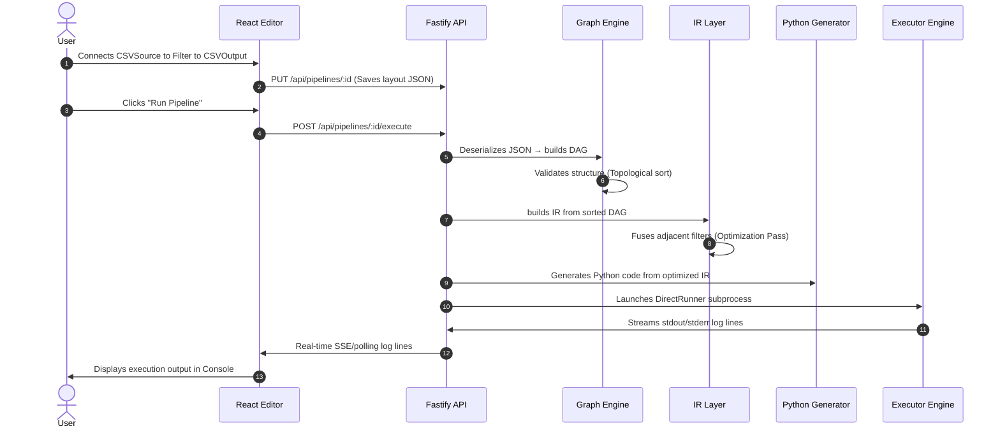

# BeamFlow — Technical Architecture & Design Document

This document outlines the system architecture, design patterns, and data flow of **BeamFlow**, an open-source visual pipeline builder for Apache Beam.

### Related documents
- [schema-propagation.md](schema-propagation.md) — design-time schema/column inference engine.
- [subflows.md](subflows.md) — reusable nested pipelines (grouping, expansion, parameters, port mapping).
- [projects.md](projects.md) — grouping workflows & subflows under user-owned projects.
- [db-auth-architecture.md](db-auth-architecture.md) — SQL persistence (Drizzle/SQLite/Postgres) & user auth.
- [preview-and-troubleshooting.md](preview-and-troubleshooting.md) — preview caching, cache states & debugging.
- [apache-beam-execution-model.md](apache-beam-execution-model.md), [plugin-guide.md](plugin-guide.md).

> **Note:** the Storage & Execution section below predates the SQL backend. Workflows are
> now persisted through Drizzle to SQLite (default) or PostgreSQL, not local JSON files —
> see [db-auth-architecture.md](db-auth-architecture.md). The `IStorage` decoupling still
> holds; only the shipped adapter changed.

---

## 🏛️ Architectural Overview

BeamFlow is built with a decoupled, layer-based architecture. The key design goal is **separating the visual editor's state representation from the compiled code structure**. This decoupling is achieved by inserting an **Intermediate Representation (IR)** layer between the visual graph and the target code generator.

```
┌────────────────────────────────────────────────────────┐
│               Frontend: apps/editor                    │
│   (React Flow Canvas + Zustand Store + property panel) │
└───────────────────────────┬────────────────────────────┘
                            │ (JSON Workflow Document)
                            ▼
┌────────────────────────────────────────────────────────┐
│                Backend: apps/server                    │
│     (Fastify API routes & local JSON storage)          │
└───────────────────────────┬────────────────────────────┘
                            │ (DAG Graph Initialization)
                            ▼
┌────────────────────────────────────────────────────────┐
│             DAG Graph Model: packages/graph            │
│       (Kahn's Topological Sort, Cycle Detection)       │
└───────────────────────────┬────────────────────────────┘
                            │ (Topologically Sorted Nodes)
                            ▼
┌────────────────────────────────────────────────────────┐
│        Intermediate Representation: packages/ir       │
│        (Language-Agnostic steps & fusion passes)       │
└───────────────────────────┬────────────────────────────┘
                            │ (IR Pipeline representation)
                            ▼
┌────────────────────────────────────────────────────────┐
│        Code Generator: packages/beam-generator        │
│       (Python Emitter → Executable Beam script)        │
└───────────────────────────┬────────────────────────────┘
                            │ (Generated .py file)
                            ▼
┌────────────────────────────────────────────────────────┐
│             Executor: packages/execution               │
│      (Subprocess spawn + real-time log stream)         │
└────────────────────────────────────────────────────────┘
```

### Key Subsystems & Core Packages

| Package / App | Layer | Technologies | Responsibilities |
|---|---|---|---|
| `apps/editor` | Frontend UI | React 19, React Flow 12, Zustand 5, Tailwind v4 | Visual canvas, node palette, settings forms, code preview modal, execution console. |
| `apps/server` | REST API | Fastify 5, TSX | REST routes for CRUD, code gen, execution, and local JSON storage adapter. |
| `packages/shared` | Core Types | TypeScript | Shared schemas, type definitions, and common utilities (`generateId`, `deepClone`). |
| `packages/core` | Extensibility | TypeScript | Node definitions registry (`NodeRegistry`), plugin loader (`PluginLoader`), and node-level parameter validations. |
| `packages/graph` | Graph Logic | TypeScript | Acyclic graph model (`DAG`), cycle detection, port checking, and JSON serializer. |
| `packages/ir` | Bridge / Optimizer | TypeScript | Converts DAG to Intermediate Representation (`IRBuilder`), fuses adjacent filters, warns on dead branches. |
| `packages/beam-generator` | Compilation | TypeScript | Translates IR steps into syntactically valid Apache Beam Python code (`PythonEmitter`). |
| `packages/execution` | Process Engine | Node child_process | Handles pipeline runner lifecycles, spawns Python subprocesses, installs requirements, and streams logs. |
| `packages/plugin-sdk` | Developer Kit | TypeScript | Ergonomic helper functions and contract definitions for building custom plugins. |

---

## 🔄 End-to-End Data Flow

The lifecycle of compiling and running a visual pipeline proceeds through five distinct stages:



---

## 🎨 Frontend Design & Architecture

### State Management (Zustand)
The state of the visual editor is managed by a single Zustand store (`useWorkflowStore`). This store holds:
- The React Flow nodes and edges array.
- The active selections and metadata (name, description, storage IDs).
- **Undo/Redo History**: A stack of up to 50 snapshots of the node/edge layout. Every time a connection is established, a node is dropped, or settings change, the previous state is pushed to the history stack.

### Decoupled Node Layouts
Rather than hardcoding node render components, the canvas uses a single custom node wrapper (`BaseNode`) registered for each category (`source`, `transform`, `output`, `ml`, etc.). Colors and icons are dynamically resolved from the plugin-provided definition schema, ensuring that **external plugins require zero frontend code changes to render uniquely**.

---

## 🧩 Extension & Plugin System

BeamFlow's registry contains zero hardcoded node types. Every node definition is registered through a plugin wrapper.

```typescript
export interface IPlugin {
  readonly name: string;
  readonly version: string;
  readonly description: string;
  register(registerNode: (def: INodeDefinition) => void): void;
}
```

External developers import `@beamflow/plugin-sdk` and compile their node definitions into standard JS bundles. When the server boots, the `PluginLoader` runs `register()` for each plugin. This makes the node definitions discoverable to the visual editor via the `GET /api/nodes` endpoint.

---

## 📝 Intermediate Representation (IR) Schema

The Intermediate Representation is a language-agnostic JSON format representing sequential processing steps. 

```typescript
export interface IRPipeline {
  id: string;
  name: string;
  version: string;
  steps: IRStep[];
  connections: IRConnection[];
  options?: IRPipelineOptions;
}

export interface IRStep {
  id: string;
  label: string;
  type: IRStepType; // 'read' | 'transform' | 'write' | 'combine'
  operation: string; // e.g., 'ReadFromCSV'
  params: Record<string, unknown>;
  inputs: string[]; // step IDs feeding into this step
  imports: string[]; // package modules required for this step
}
```

### Compiler Optimization Passes
Before sending the IR to the generator, the IR package passes it through optimizers:
- **`fuseFilters`**: Inspects filter sequences. If two filter steps are sequential and have a single linear input/output, they are collapsed into a single filter step running a logical `&&` condition. The connections are automatically rerouted.
- **`detectDeadBranches`**: Validates whether transform steps (excluding terminal output/write steps) have downstream consumers. Warnings are logged for orphan execution paths.

---

## 🐍 Python Beam Code Generation

The `@beamflow/beam-generator` package takes the optimized IR and compiles it into PEP-8 compliant Python code.

### Deduplicated Imports
The generator maintains separate collections for standard imports (`import json`) and from-imports (`from apache_beam import io`). During code assembly, it groups all sub-imports from the same module, deduplicates them, sorts them alphabetically, and writes them at the top of the file.

### Safe Variable Resolution
Since node IDs generated in the frontend can contain special characters (e.g., `node_cW58aIf-dffq`), they are sanitized into safe Python variable names (`step_node_cW58aIf_dffq`) before emission.

---

## 💾 Storage & Execution Layer

### Storage Decoupling
Workflows are stored using a simple `IStorage` interface:
```typescript
export interface IStorage {
  list(): Promise<SerializedWorkflow[]>;
  get(id: string): Promise<SerializedWorkflow | null>;
  save(workflow: SerializedWorkflow): Promise<void>;
  delete(id: string): Promise<boolean>;
}
```
The MVP ships with a `LocalJsonStorage` adapter storing JSON configuration files in `~/.beamflow/pipelines/`. Switching the storage backend to PostgreSQL, MongoDB, or Google Cloud Storage simply requires implementing a class matching this interface.

### Executor Sandbox
When a pipeline runs:
1. A unique execution workspace directory (`exec_<id>`) is created in the temp directory.
2. The generated code is saved as a Python script (`<pipeline_id>_pipeline.py`).
3. An optional `requirements.txt` file is generated containing all imports/dependencies specified by the node definitions.
4. If dependencies are required, `pip install` is run in the temporary directory.
5. The pipeline is spawned as a child process utilizing Apache Beam's `DirectRunner`. Output is captured and sent back to the client via SSE/polling.
