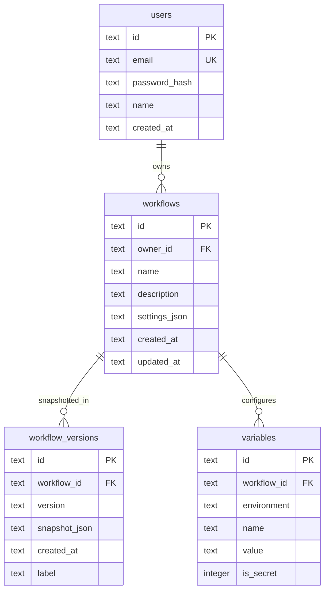

# Database & User Auth Architecture

This document describes the design-time data persistence, authentication structure, and security isolation layers implemented in BeamFlow.

---

## 1. High-Level Architectural View

BeamFlow has a decoupled architecture where the visual designer persists metadata (diagram structures, user variables, and version control) to a SQL database, while the runtime execution engine runs on independent workers (Apache Beam).

```
 ┌─────────────────────────────────────────────────────────┐
 │                      VISUAL EDITOR                      │
 │                  (React + Zustand UI)                   │
 └────────────────────────────┬────────────────────────────┘
                              │
                              │ HTTP + JWT (Bearer)
                              ▼
 ┌─────────────────────────────────────────────────────────┐
 │                   FASTIFY REST SERVER                   │
 │                                                         │
 │  ┌────────────────┐ ┌────────────────┐ ┌─────────────┐  │
 │  │  Public Routes │ │  Auth Routes   │ │ Auth Hook   │  │
 │  │  (/nodes)      │ │  (/auth/*)     │ │ (Verify)    │  │
 │  └────────────────┘ └────────────────┘ └──────┬──────┘  │
 │                                               │         │
 │  ┌────────────────────────────────────────────▼──────┐  │
 │  │            Protected Routes Namespace             │  │
 │  │      (/pipelines/*, /variables/*, /versions/*)    │  │
 │  └────────────────────────────────────┬──────────────┘  │
 └───────────────────────────────────────┼─────────────────┘
                                         │
                                         ▼
 ┌─────────────────────────────────────────────────────────┐
 │                    REPOSITORIES LAYER                   │
 │       (Users, Workflows, Variables, Versions Repos)     │
 └───────────────────────────────┬─────────────────────────┘
                                 │
                                 ▼
 ┌─────────────────────────────────────────────────────────┐
 │                       DRIZZLE ORM                       │
 └───────────────────────────────┬─────────────────────────┘
                                 │
                 ┌───────────────┴───────────────┐
                 │ (Development)                 │ (Production)
                 ▼                               ▼
      ┌─────────────────────┐         ┌─────────────────────┐
      │    LibSQL/SQLite    │         │     PostgreSQL      │
      │   (Local DB File)   │         │ (DATABASE_URL Cloud)│
      └─────────────────────┘         └─────────────────────┘
```

---

## 2. Technical Stack

- **ORM:** [Drizzle ORM](https://orm.drizzle.team/) (dialect-agnostic schemas, lightweight runtime, fully type-safe SQL query generation).
- **SQLite Engine:** `@libsql/client` (native LibSQL client wrapper. It provides robust precompiled binaries for Windows/PowerShell environments, avoiding native compilation failures with standard `node-gyp`).
- **PostgreSQL Engine:** `postgres` (highly optimized PostgreSQL client for production connections).
- **Auth Tokens:** `@fastify/jwt` (HMAC SHA-256 signed JSON Web Tokens).
- **Encryption:** `bcryptjs` (password hashing with 10 salt rounds).

---

## 3. Database Schema Design

The tables are configured in `apps/server/src/db/schema.ts`. The schema uses structure-equivalent definitions for SQLite and PostgreSQL:



---

## 4. Key Security & Implementation Patterns

### A. Encapsulated Authentication Scopes
Fastify handles plugins by creating scoped contexts. In `app.ts`, the authentication hook is registered using:
```typescript
app.decorate('authenticate', async (request, reply) => { ... });
```
Inside the routes, protected endpoints are nested inside an `app.register(...)` block, applying the `preHandler` hook *locally*:
```typescript
app.register(async (appWithAuth) => {
  appWithAuth.addHook('preHandler', app.authenticate);
  appWithAuth.get('/api/pipelines', ...); // Secured
});
```
This isolates the auth guard, keeping metadata routes (`/api/nodes`) and health checks public.

### B. User-Scoped Data Fetching (Row-Level Security)
Every repository operation takes the authenticated user ID (`req.user.id`) as a mandatory parameter:
```typescript
// workflows.repo.ts
async get(id: string, ownerId: string): Promise<SerializedWorkflow | null> {
  const results = await db
    .select()
    .from(workflowsTable)
    .where(and(eq(workflowsTable.id, id), eq(workflowsTable.ownerId, ownerId)));
  ...
}
```
If User A requests a pipeline owned by User B, the query returns no rows, resulting in a `404 Not Found` response. Attempting to modify or delete another user's pipeline results in a `404 / 403` boundary.

### C. Dynamic Database Routing
The connection manager `src/db/client.ts` detects the driver format on initialization:

```typescript
const dbUrl = process.env.DATABASE_URL;
const isPg = !!(dbUrl?.startsWith('postgresql://') || dbUrl?.startsWith('postgres://'));

if (isPg) {
  // postgres-js client for PostgreSQL
} else if (process.env.NODE_ENV === 'test') {
  // SQLite in-memory client for Vitest isolation
} else {
  // LibSQL client for local file 'beamflow.db'
}
```

### E. Client-Side JWT Lifecycle
1. **Attachment:** The API client interceptor in `api/client.ts` automatically extracts `bf_token` from `localStorage` and appends it to request headers:
   ```typescript
   headers['Authorization'] = `Bearer ${token}`;
   ```
2. **Rejection Hook:** If the API returns `401 Unauthorized` (expired or invalid token), the interceptor clears local cache and dispatches a global event:
   ```typescript
   window.dispatchEvent(new Event('bf-unauthorized'));
   ```
3. **Reactive Re-route:** The Zustand `auth-store.ts` listens to the event, transitions state to unauthenticated, and mounts the login form immediately.
